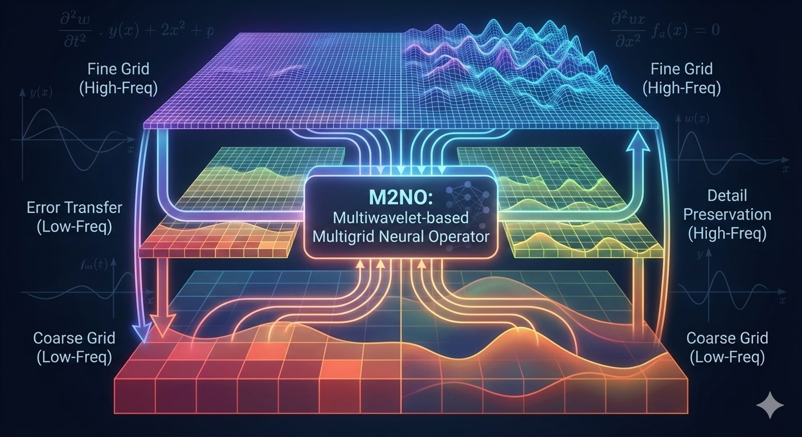
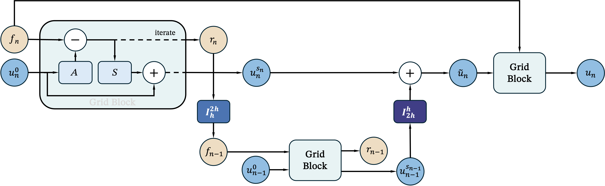

# M2NO: An Efficient Multi-Resolution Operator Framework for Dynamic Multi-Scale PDE Solvers

[](https://kdd2026.kdd.org/)
[](https://arxiv.org/abs/2406.04822)
<!-- [](https://doi.org/10.1145/3770854.3780179) -->
<!-- [](https://opensource.org/licenses/MIT) -->



Official code for **M2NO**, a **multi-resolution neural operator** framework that integrates **multigrid-style V-cycles** with **predefined multiwavelet spaces** for efficient and scalable PDE operator learning.

- Paper (arXiv): https://arxiv.org/abs/2406.04822  
- Paper (DOI / ACM DL): https://doi.org/10.1145/3770854.3780179  
- Code: https://github.com/lizhihao2022/M2NO  

---

## Framework Overview



---

## Quick Start

### 1) Clone
```bash
git clone https://github.com/lizhihao2022/M2NO.git
cd M2NO
````

### 2) Create environment (example)

```bash
conda create -n m2no python=3.10 -y
conda activate m2no
```

### 3) Install dependencies

This repository is organized as a research codebase. Install dependencies based on your CUDA / PyTorch setup.

```bash
pip install -r requirements.txt
```

### 4) Run an experiment (config-driven)

```bash
python main.py --config configs/ns2d.yaml
```

Other examples:

```bash
python main.py --config configs/burgers.yaml
python main.py --config configs/darcy.yaml
python main.py --config configs/diff.yaml
python main.py --config configs/era5.yaml
```

Typical workflow:

1. Choose a YAML in `configs/`.
2. Set dataset paths (either in the YAML or via defaults in `config.py`).
3. Launch `main.py`.

---

## Code Structure

```text
.
├── configs/
│   ├── burgers.yaml       # Burgers (time-dependent) experiments
│   ├── darcy.yaml         # Darcy flow experiments
│   ├── diff.yaml          # Diffusion-reaction / related experiments
│   ├── era5.yaml          # ERA5 experiments
│   └── ns2d.yaml          # 2D Navier–Stokes experiments
│
├── datasets/
│   ├── __init__.py
│   ├── advection.py       # Advection dataset loader
│   ├── burgers_time.py    # Time-dependent Burgers dataset loader
│   ├── darcy.py           # Darcy dataset loader
│   ├── diff_react_2d.py   # 2D diffusion-reaction dataset loader
│   ├── era5.py            # ERA5 dataset loader
│   └── ns.py              # Navier–Stokes dataset loader (2D)
│
├── models/
│   ├── __init__.py
│   └── m2no/              # Core M2NO modules (operator blocks, wavelet/multigrid components, etc.)
│
├── procedure/
│   ├── __init__.py
│   ├── advection.py       # Task-specific training/eval pipeline for Advection
│   ├── burgers.py         # Task-specific training/eval pipeline for Burgers
│   ├── darcy.py           # Task-specific training/eval pipeline for Darcy
│   ├── difftract.py       # Task-specific training/eval pipeline for Diffusion(-reaction)
│   ├── era5.py            # Task-specific training/eval pipeline for ERA5
│   └── ns.py              # Task-specific training/eval pipeline for Navier–Stokes 2D
│
├── trainers/
│   ├── __init__.py
│   ├── base.py            # Base trainer utilities (loop, logging hooks, ckpt helpers)
│   ├── m2no1d.py          # 1D trainer entry (advection / burgers variants)
│   └── m2no2d.py          # 2D trainer entry (darcy / ns2d / diff-react / era5 variants)
│
├── utils/                 # Common utilities (I/O, metrics, seeds, distributed helpers, etc.)
│
├── config.py              # Global configuration / path defaults
└── main.py                # Unified entry point
```

---

## Configuration & Execution Model

* `main.py` is the single entry point.
* A YAML config in `configs/` selects:

  * dataset/task (e.g., `ns2d`, `era5`, `darcy`, `burgers`, `diff`)
  * model settings (M2NO depth/width, resolutions, wavelet/multigrid options)
  * training schedule (epochs/iters, lr, batch size, logging, checkpointing)
* `procedure/*.py` contains **task-specific** pipelines (train/eval/rollout), while `trainers/*.py` provides reusable trainer logic.

---

## Data Sources


This repository supports widely used PDE learning benchmarks and reanalysis data. Please follow the corresponding dataset licenses/terms. We do **not** redistribute third-party datasets.

### 1) NeuralOperator datasets

* Project: [https://github.com/neuraloperator/neuraloperator](https://github.com/neuraloperator/neuraloperator)
* Documentation: [https://neuraloperator.github.io/](https://neuraloperator.github.io/)

Used for standard neural operator benchmarks (dataset/task depends on your config).

### 2) PDEBench

* Repository: [https://github.com/pdebench/PDEBench](https://github.com/pdebench/PDEBench)
* NeurIPS Datasets & Benchmarks page:
  [https://proceedings.neurips.cc/paper_files/paper/2022/hash/0a9747136d411fb83f0cf81820d44afb-Abstract-Datasets_and_Benchmarks.html](https://proceedings.neurips.cc/paper_files/paper/2022/hash/0a9747136d411fb83f0cf81820d44afb-Abstract-Datasets_and_Benchmarks.html)

Provides a collection of PDE datasets and standardized evaluation protocols.

### 3) ERA5 (Copernicus / ECMWF reanalysis)

* CDS dataset entry (single levels): [https://cds.climate.copernicus.eu/datasets/reanalysis-era5-single-levels](https://cds.climate.copernicus.eu/datasets/reanalysis-era5-single-levels)
* ERA5 overview: [https://www.ecmwf.int/en/forecasts/dataset/ecmwf-reanalysis-v5](https://www.ecmwf.int/en/forecasts/dataset/ecmwf-reanalysis-v5)

ERA5 downloads typically require a Copernicus Climate Data Store account and use the CDS API.

> Practical note: point your config/data root to where you store the downloaded/preprocessed files, and use the corresponding loader in `datasets/era5.py`.

---

## Citation

If you use this work, please cite:

```bibtex
@misc{li2025m2no,
  title         = {M2NO: An Efficient Multi-Resolution Operator Framework for Dynamic Multi-Scale PDE Solvers},
  author        = {Zhihao Li and Zhilu Lai and Xiaobo Zhang and Wei Wang},
  year          = {2025},
  eprint        = {2406.04822},
  archivePrefix = {arXiv},
  primaryClass  = {cs.LG},
  url           = {https://arxiv.org/abs/2406.04822}
}
```

---

## Acknowledgements

This codebase interoperates with community resources including **NeuralOperator**, **PDEBench**, and **ERA5**. We thank the authors and maintainers of these ecosystems.

---

## Contact

* Please open a GitHub issue for bug reports and feature requests.
* For research questions, refer to the authors listed on the paper.